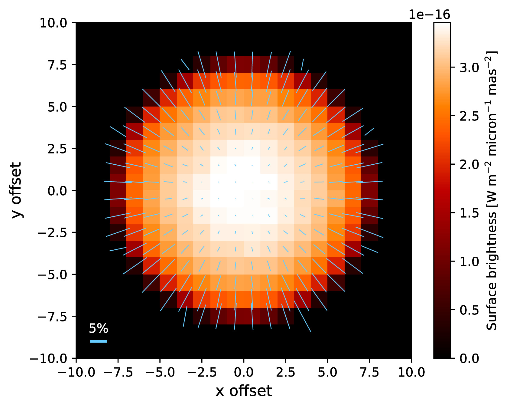
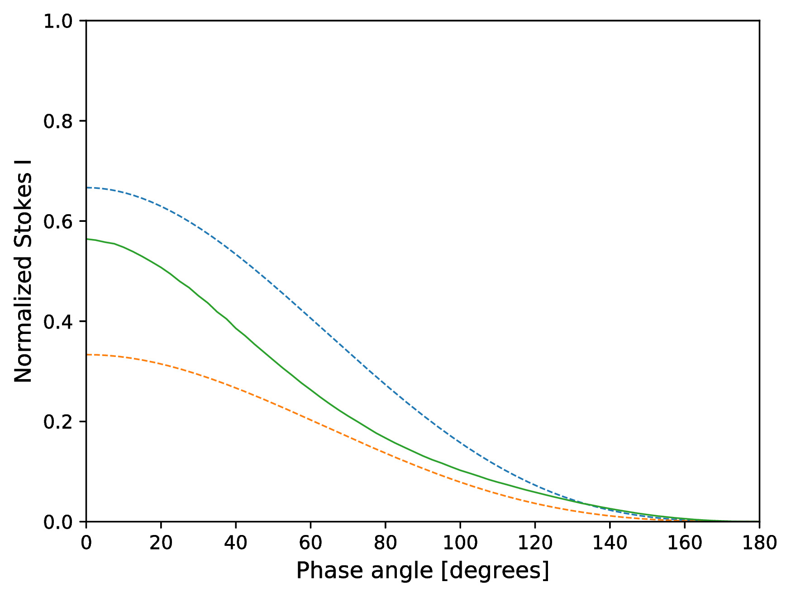
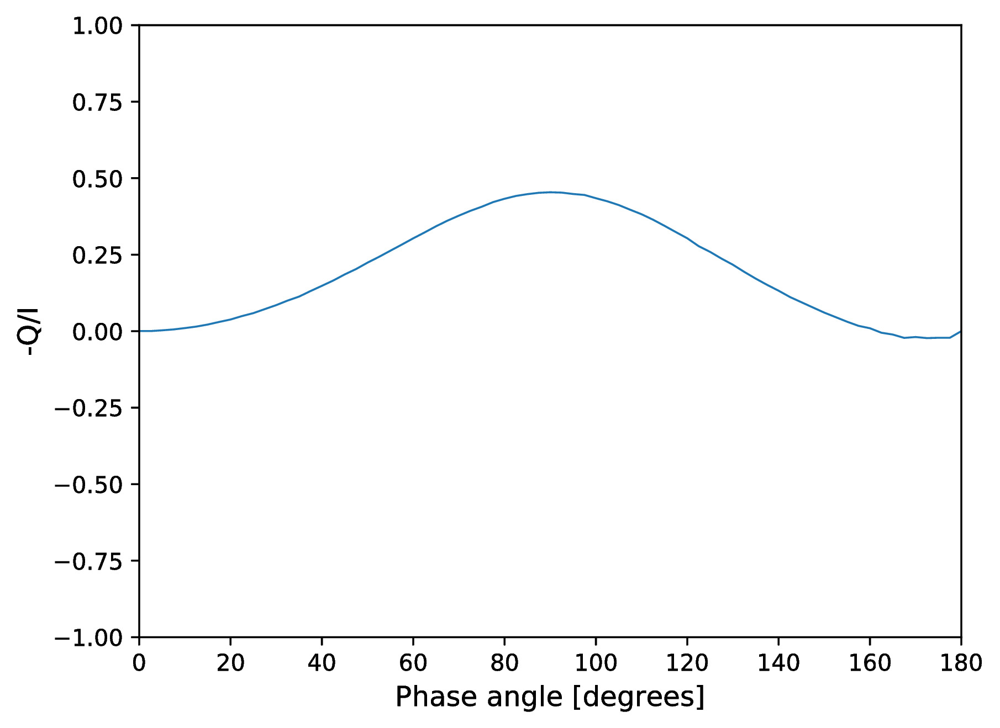
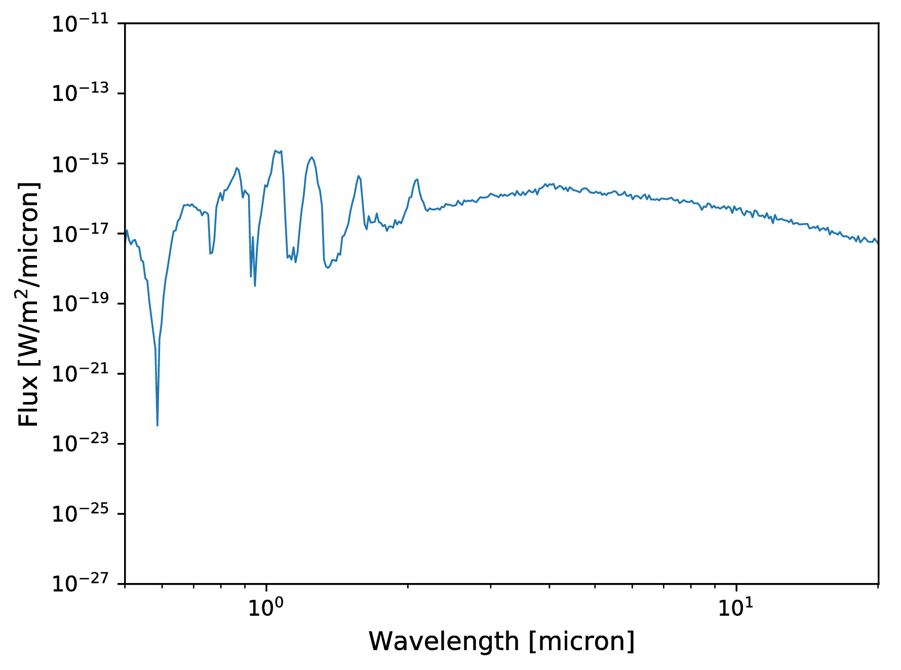
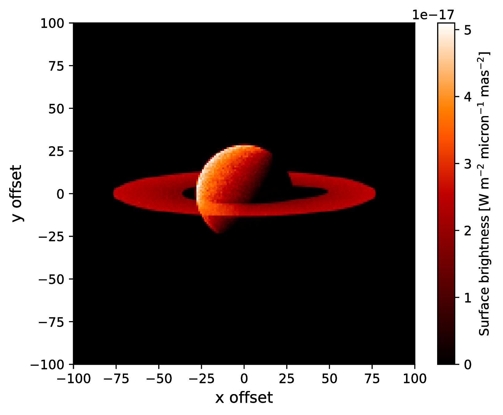

.. _examples:

Examples
========

Here you can find several examples of simulations with ARTES. Links are provided to the input files with some easy instructions included.

Limb polarization image from a Rayleigh scattering atmosphere
-------------------------------------------------------------

The first example simulates an Stokes I, Q, and U image in backward direction from a Rayleigh scattering atmosphere. The image below is created with the `plot_image.py` routine in the tools folder. The image shows the Stokes I flux and the vectors denote the direction and degree of polarization. The input files can be downloaded `here <https://home.strw.leidenuniv.nl/~stolker/artes/limb_polarization.tar.gz>`__.

Phase curve from a Rayleigh scattering atmosphere
-------------------------------------------------

The second example simulates phase curve of a Rayleigh scattering atmosphere. That is, the disk-integrated flux along the different phases (i.e., scattering angles) of the planet. The figures show the Stokes I flux and the fractional polarization. The input files can be downloaded `here <https://home.strw.leidenuniv.nl/~stolker/artes/rayleigh.tar.gz>`__.

Reflected light spectrum from a Jupiter-like planet
---------------------------------------------------

The next example simulates a reflected light spectrum at a scattering angles of 90 degrees from a gaseous atmosphere with methane absorption (see Stam et al. 2004). The figures show the spectrum of the normalized Stokes I flux and the degree of polarization (with low spectral resolution). The input files can be downloaded `here <https://home.strw.leidenuniv.nl/~stolker/artes/jupiter.tar.gz>`__.

.. image:: _images/reflected_spectrum_stokes_i.jpg
   :width: 70%
   :align: center

.. image:: _images/reflected_spectrum_polarization.jpg
   :width: 70%
   :align: center

Emission spectrum from a self-luminous planet
---------------------------------------------

This example simulates an emission spectrum from a self-luminous gas giant with a clear atmosphere. Molecule opacities and mixing ratios are interpolated from a pre-calculated computed by assuming equilibrium chemistry. The input files can be downloaded `here <https://home.strw.leidenuniv.nl/~stolker/artes/selfluminous.tar.gz>`__.

Reflected light image of a planet with a circumplanetary ring
-------------------------------------------------------------

This last example simulates a reflected light image at a scattering angles of 90 degrees of a planet that is surrounded by a circumplanetary ring. The image shows the Stokes I surface brightness. The input files can be downloaded `here <https://home.strw.leidenuniv.nl/~stolker/artes/circumplanetary.tar.gz>`__.

